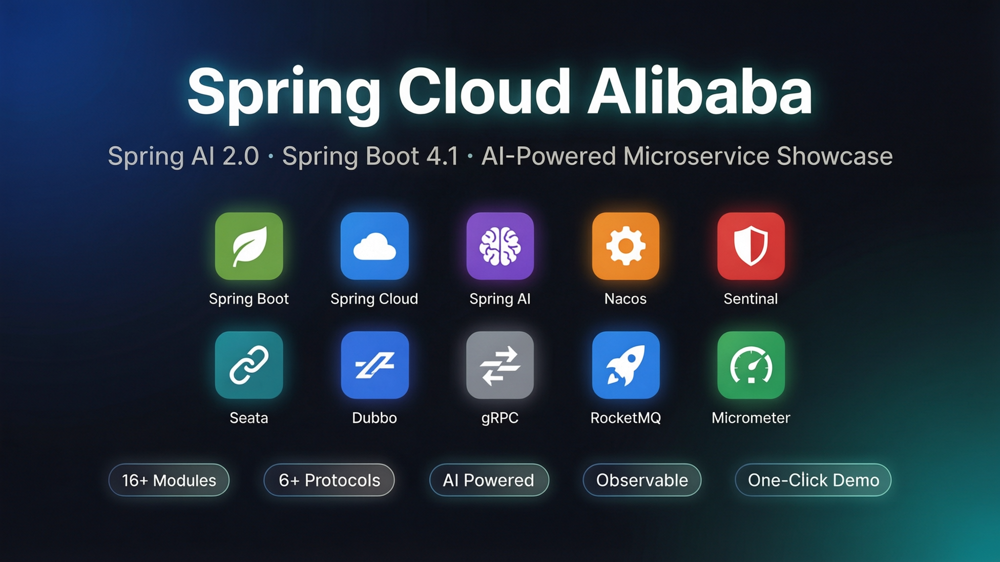
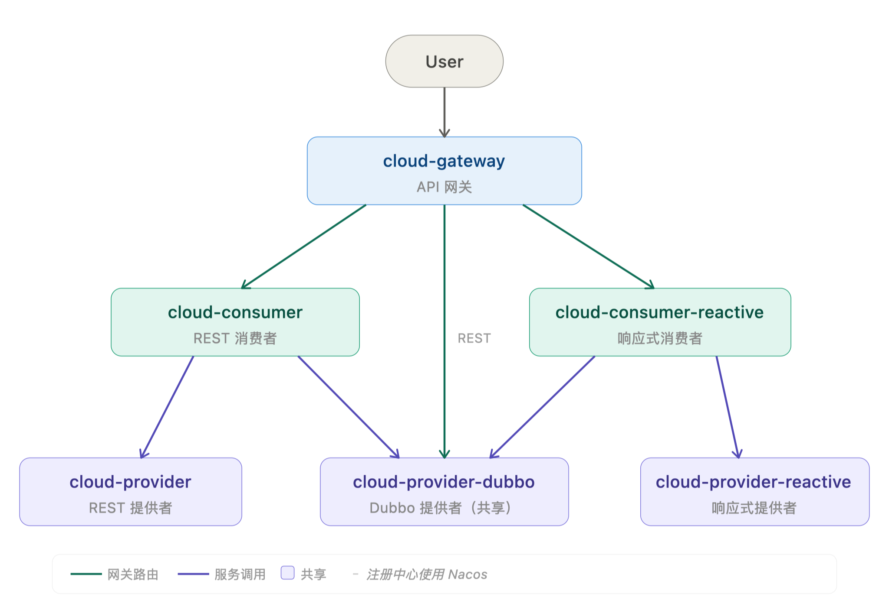

# ☁️ Spring Cloud Alibaba Samples
> 基于 **Spring Boot 4.1** + **Spring Cloud Alibaba 2025.1.x** 的生产级微服务示例项目 <br>
> 涵盖 17 个模块，覆盖 HTTP / Dubbo / gRPC / Stream / Kafka 多协议通信与消息驱动、Spring AI 多模态集成及 Seata 分布式事务，支持一键演示与验证



### 📦 模块介绍
| 模块                               | 简称                | 端口    | 说明                    |
|----------------------------------|-------------------|-------|-----------------------|
| 🔍 cloud-nacos-discovery-sample  | discovery         | 8760  | Nacos Discovery       |
| ⚙️ cloud-nacos-config-sample     | config            | 8761  | Nacos Config          |
| ⚡ cloud-provider-reactive-sample | provider-reactive | 8762  | Reactive Web Provider |
| ⚡ cloud-consumer-reactive-sample | consumer-reactive | 8763  | Reactive Web Consumer |
| 🌐 cloud-gateway-sample          | gateway           | 8764  | Spring Cloud Gateway  |
| 📤 cloud-provider-sample         | provider          | 8765  | Web Provider          |
| 📥 cloud-consumer-sample         | consumer          | 8766  | Web Consumer          |
| 🚀 cloud-provider-dubbo-sample   | provider-dubbo    | 50051 | Dubbo Provider        |
| 🔌 cloud-grpc-server-sample      | grpc-server       | 9090  | gRPC Server           |
| 📋 cloud-sample-api              | api               | -     | Interface & Proto     |
| 🧩 cloud-commons                 | commons           | -     | Cloud Commons         |
| 📨 cloud-stream-sample           | stream            | 8767  | Spring Cloud Stream   |
| 🔄 cloud-seata-sample            | seata             | -     | Seata (含 7 个子模块)      |
| 🕒 cloud-scheduling-sample       | scheduling        | -     | Alibaba Schedulerx    |
| 🤖 cloud-ai-sample               | ai                | 8888  | Spring AI             |
| 🤖 cloud-ai-rag-sample           | rag               | 8889  | Spring AI · RAG       |
| 📨 cloud-kafka-sample            | kafka             | 8768  | Kafka 4.x             |

<picture>
  <source srcset="arch.svg" type="image/svg+xml">
  
</picture>

### 🎮 演示方式

| 方式                  | 说明                                | 适用场景       |
|---------------------|-----------------------------------|------------|
| 🤖 **AI Skill（推荐）** | 告诉 AI 助手 "演示项目"，自动完成环境检查、启动、验证全流程 | 快速体验、集成测试  |
| 📜 **一键脚本**         | 通过 `start-all.sh` 脚本自动化启动和验证      | 批量验证、CI/CD |
| 🐳 **Docker 部署**    | 中间件本地运行，微服务全部容器化                  | 容器化实践、贴近生产 |
| 🔧 **手动启动**         | 逐个模块手动启动，灵活控制                     | 学习调试、单模块开发 |

#### 🤖 AI 一键演示（推荐）

> 本项目内置 Qoder Agent Skill，clone 后在 Qoder 中输入 `/demo-spring-cloud` 或告诉 AI "演示项目"，
> 即可自动完成环境检查、服务启动、接口验证全流程，无需手动操作。

```
# 快速体验（仅需 Nacos）
告诉 AI: "演示本项目"

# 单独验证某个场景
告诉 AI: "验证 Seata 分布式事务"
告诉 AI: "验证 Stream 消息收发"
告诉 AI: "演示 Spring AI"
告诉 AI: "演示一下视觉识别"
```

详见 [SKILL.md](.qoder/skills/demo-spring-cloud/SKILL.md)

#### 📜 一键脚本

```shell
# 查看所有命令
sh start-all.sh --help

# 常用命令
sh start-all.sh install  # 检查并安装中间件（Nacos/RocketMQ/MySQL/Seata）+ 打包模块
sh start-all.sh          # 启动所有服务（自动检查前置条件、打包、启动、验证）
sh start-all.sh seata    # 仅启动 Seata 分布式事务 (7个模块)
sh start-all.sh build    # 打包所有模块
sh start-all.sh verify   # 执行验证（不启动，仅验证已运行的服务）
sh start-all.sh status   # 查看服务状态
sh start-all.sh logs <模块名>  # 查看模块日志（如 ai, stream, provider）
sh start-all.sh stop     # 停止所有服务（含 RocketMQ、Seata Server）
sh start-all.sh restart  # 重启所有服务
sh start-all.sh clean    # 清理构建产物
```

> 脚本流程：检查 Nacos → 检查 RocketMQ/MySQL/Seata Server（自动启动）→ 安装依赖模块 → 打包 → 按顺序启动所有模块 → 执行验证 → 汇总结果

#### 🐳 Docker 部署

中间件本地运行，微服务全部 Docker 容器化，通过 `host.docker.internal` 连接宿主机中间件。

**架构**

```
Mac 宿主机
├── 本地中间件: Nacos(8848) / RocketMQ(9876) / MySQL(3306) / PostgreSQL(5432) / Kafka(9092,9094,9096)
│
└── Docker 容器 (通过 host.docker.internal 连宿主机)
    ├── 核心微服务 (9个): gateway / consumer / provider / grpc-server ...
    ├── Stream 消息         (profile: stream)
    ├── Kafka Share Groups  (profile: kafka)
    ├── Spring AI           (profile: ai)
    └── Seata 分布式事务   (profile: seata)
```

**快速开始**

```shell
# 1. 启动本地中间件（Nacos / RocketMQ / MySQL / PostgreSQL）
./start-all.sh infra

# 2. Maven 打包 + 构建所有 Docker 镜像
./docker-build.sh build

# 3. 启动核心微服务 (9个)
./docker-build.sh up

# 4. 验证
curl 'http://localhost:8766/hi?name=docker'
curl 'http://localhost:8764/consumer-sample/hi?name=docker'
```

**常用命令**

```shell
./docker-build.sh up          # 启动核心微服务 (9个)
./docker-build.sh up-seata    # 启动 Seata 分布式事务 (7个)
./docker-build.sh up-all      # 启动全部 (含 Stream/Kafka/AI/Seata)
./docker-build.sh down        # 停止所有微服务
./docker-build.sh status      # 查看容器状态
./docker-build.sh logs [svc]  # 查看日志
./docker-build.sh clean       # 停止并清理
```

**单模块部署**

```shell
# 打包单个模块
./mvnw package -DskipTests -pl cloud-provider-sample -am

# 构建镜像 + 启动
docker build --build-arg MODULE=cloud-provider-sample -t spring-cloud-samples/provider .
docker compose up -d provider
```

Seata 示例（需前置 MySQL + Seata Server，7 个子模块需同时启动）：
```shell
# 打包 Seata 所有子模块
./mvnw package -DskipTests -pl cloud-seata-sample/business-service,cloud-seata-sample/order-service,cloud-seata-sample/storage-service,cloud-seata-sample/account-service,cloud-seata-sample/account-dubbo-service,cloud-seata-sample/storage-dubbo-service,cloud-seata-sample/order-dubbo-service -am

# 一次性启动 Seata 全部服务
./docker-build.sh up-seata
```

> Docker 需要 [OrbStack](https://orbstack.dev)（`brew install orbstack`），国内拉镜像需配置[镜像加速](https://docs.orbstack.dev/docker/registry-mirrors)。

#### 🔧 手动启动

按下面的功能演示章节逐步操作即可，每个章节都包含前置条件、启动顺序和验证命令。

### 🔍 服务注册与发现演示
> 首先安装部署 Nacos，完成后设置环境变量
```shell
export SPRING_CLOUD_NACOS_USERNAME=your_username
export SPRING_CLOUD_NACOS_PASSWORD=your_password
```

#### 🟢 Nacos Discovery 演示
启动discovery，访问如下接口
```shell
curl http://localhost:8760/discovery/instances
```

#### 🌐 普通 Web 服务的注册与发现
依次启动provider,consumer,gateway <br>
直接访问(consumer → provider)
```shell
curl 'http://localhost:8766/hi?name=hongxi'
```
通过网关访问(gateway → consumer → provider)
```shell
curl 'http://localhost:8764/consumer-sample/hi?name=hongxi'
```

#### ⚡ Reactive Web 服务注册与发现
接着启动provider-reactive,consumer-reactive <br>
直接访问(consumer-reactive → provider-reactive)
```shell
curl 'http://localhost:8763/hi?name=hongxi'
```
通过网关访问(gateway → consumer-reactive → provider-reactive)
```shell
curl 'http://localhost:8764/consumer-reactive-sample/hi?name=hongxi'
```

#### 🚀 Dubbo 服务注册与发现
接着启动provider-dubbo <br>
直接访问(consumer → provider-dubbo)
```shell
curl 'http://localhost:8766/dubbo?name=hongxi'
```
通过网关访问(gateway → consumer → provider-dubbo)
```shell
curl 'http://localhost:8764/consumer-sample/dubbo?name=hongxi'
```
直接访问(consumer-reactive → provider-dubbo)
```shell
curl 'http://localhost:8763/dubbo?name=hongxi'
```
通过网关访问(gateway → consumer-reactive → provider-dubbo)
```shell
curl 'http://localhost:8764/consumer-reactive-sample/dubbo?name=hongxi'
```

#### 🔌 gRPC 服务注册与发现
直接利用 Spring Cloud 的服务注册能力，引入`discovery`和`webmvc`依赖，<br>
同时，需要设置注册到注册中心的端口，否则默认注册的是`server.port`
```yaml
server:
  port: 8090 # Web端口
spring:
  cloud:
    nacos:
      discovery:
        port: ${spring.grpc.server.port} # 注册到注册中心的端口
  grpc:
    server:
      port: 9090 # gRPC端口
```
关于服务发现，Spring Cloud 与 gRPC 是两套服务发现模式，本项目使用 <br>
NameResolver SPI 桥接 DiscoveryClient 方式实现了两者服务发现模式的集成， <br>
具体实现请参考`cloud-commons`模块<br>
接着前面的，启动grpc-server <br>
直接访问(consumer → grpc-server)
```shell
curl 'http://localhost:8766/grpc?name=hongxi'
```
通过网关访问(gateway → consumer → grpc-server)
```shell
curl 'http://localhost:8764/consumer-sample/grpc?name=hongxi'
```

#### 🌐 Dubbo REST 服务发现
启动provider-dubbo,gateway <br>
直接访问`dubbo rest`接口
```shell
curl http://localhost:50051/api/hello/lily
curl 'http://localhost:50051/api/add?a=1&b=2'
curl -X POST http://localhost:50051/api/echo -H "Content-Type: application/json" -d '{"message":"hi"}'
curl 'http://localhost:50051/api/greet/lily?lang=zh'
```
通过网关访问`dubbo rest`接口(gateway → provider-dubbo)
```shell
curl http://localhost:8764/provider-dubbo-sample/api/hello/lily
curl 'http://localhost:8764/provider-dubbo-sample/api/add?a=1&b=2'
curl -X POST http://localhost:8764/provider-dubbo-sample/api/echo -H "Content-Type: application/json" -d '{"message":"hi"}'
curl 'http://localhost:8764/provider-dubbo-sample/api/greet/lily?lang=zh'
```

### 🔍 Trace 链路追踪

项目内置 trace 传播验证脚本，覆盖五条跨服务链路，验证 Spring Boot Observation 与各框架的 trace context 自动/手动传播：

| 链路                  | 路径                                    | trace 传播                        |
|---------------------|---------------------------------------|---------------------------------|
| Web → Web           | consumer → provider                   | RestTemplate / FeignClient 自动传播 |
| Web → gRPC          | consumer → grpc-server                | gRPC Interceptor 自动传播           |
| Web → Dubbo         | consumer → provider-dubbo             | Dubbo ObservationFilter 自动传播    |
| Reactive → Reactive | consumer-reactive → provider-reactive | WebClient 手动传递 traceparent      |
| Reactive → Dubbo    | consumer-reactive → provider-dubbo    | Dubbo ObservationFilter 自动传播    |

```shell
bash .qoder/skills/demo-spring-cloud/verify-trace.sh
```

此外，gateway、consumer-sample、business-service 三个模块集成了 `micrometer-registry-prometheus`，可直接访问 `/actuator/prometheus` 查看 Prometheus 格式的指标数据：
```shell
curl http://localhost:8764/actuator/prometheus   # gateway
curl http://localhost:8766/actuator/prometheus   # consumer-sample
curl http://localhost:18081/actuator/prometheus  # business-service (Seata)
```

### ⚙️ Nacos Config 动态配置

启动 `cloud-nacos-config-sample`（端口 8761），通过模块提供的接口管理配置（避免直接调用 Nacos API 的鉴权问题）：
```shell
# 发布配置
curl 'http://localhost:8761/nacos/publishConfig?dataId=my.city&content=wuhan'
# 获取配置
curl 'http://localhost:8761/nacos/getConfig?dataId=my.city'
```

模块还演示了 `@NacosConfig`、`@ConfigurationProperties`、`@Value` + `@RefreshScope` 三种配置绑定方式，详细演示步骤参考 [SKILL.md](.qoder/skills/demo-spring-cloud/SKILL.md) 中的 Nacos Config 章节。

### 🛡️ Sentinel Gateway 演示
`cloud-gateway-sample`集成了sentinel，并采用nacos配置规则，规则示例如下 <br>
group-id: SENTINEL_GROUP <br>
data-id: cloud.sample.gateway.gw-api-group
```json
[
  {
    "apiName": "consumer_reactive_api",
    "predicateItems": [
      {
        "pattern": "/consumer-reactive-sample/**",
        "matchStrategy": 1
      }
    ]
  },
  {
    "apiName": "consumer_api",
    "predicateItems": [
      {
        "pattern": "/consumer-sample/**",
        "matchStrategy": 1
      }
    ]
  }
]
```
group-id: SENTINEL_GROUP <br>
data-id: cloud.sample.gateway.gw-flow
```json
[
  {
    "resource": "consumer_reactive_api",
    "resourceMode": 1,
    "count": 10
  },
  {
    "resource": "consumer_api",
    "resourceMode": 1,
    "count": 5
  },
  {
    "resource": "consumer-reactive-sample",
    "resourceMode": 0,
    "count": 20
  }
]
```
演示：在浏览器快速刷新访问几次如下接口
```text
http://localhost:8764/consumer-sample/hi?name=hongxi
```
触发限流时返回
```json
{"code":444,"msg":"Sentinel gateway block"}
```

### 🛡️ Sentinel 应用级熔断降级

`cloud-consumer-sample` 集成了 Sentinel，通过 Nacos 动态推送规则，演示两类场景：
- **限流**：`sentinel-spring-webmvc-v6x-adapter` 自动将 Controller 接口（如 `/hi`）注册为 Sentinel 资源，推送 flow 规则即可限制入口 QPS
- **熔断降级**：Feign / RestTemplate 调用下游服务时，通过 Sentinel 熔断规则保护出站调用，异常时走 fallback

| 场景              | 资源名                                             | 规则类型    | 说明                   |
|-----------------|-------------------------------------------------|---------|----------------------|
| 接口限流            | `/hi`（URI 自动注册）                                 | flow    | 限制 consumer 自身接口 QPS |
| Feign 熔断        | `GET:http://provider-sample/hello` （Feign 自动生成） | degrade | 下游异常时触发 fallback     |
| RestTemplate 熔断 | `GET:http://provider-sample`（urlCleaner 去端口后）   | degrade | 下游异常时触发 fallback     |

规则通过 Nacos 数据源动态推送（无需重启），group: `SENTINEL_GROUP`

| 数据源 | data-id                         | 规则类型          |
|-----|---------------------------------|---------------|
| ds1 | `cloud.sample.consumer.flow`    | 限流（flow）      |
| ds2 | `cloud.sample.consumer.degrade` | 熔断降级（degrade） |

前置条件：启动 `cloud-nacos-config-sample`（端口 8761），通过其 `/nacos/publishConfig` 接口推送规则。

**演示限流（consumer 自身接口）**

1. 推送限流规则，资源名 `/hi`，QPS 阈值 = 1：
```shell
curl -s --get --data-urlencode 'dataId=cloud.sample.consumer.flow' --data-urlencode 'group=SENTINEL_GROUP' --data-urlencode 'type=json' --data-urlencode 'content=[{"resource":"/hi","grade":1,"count":1}]' 'http://localhost:8761/nacos/publishConfig'
```

2. 快速连续调用，第二次请求被限流：
```shell
curl 'http://localhost:8766/hi?name=test&version=2.0'
curl 'http://localhost:8766/hi?name=test&version=2.0'
# 第二次返回: Blocked by Sentinel
```

**演示熔断降级（Feign + RestTemplate 出站调用）**

`SentinelProtectInterceptor` 为 RestTemplate 创建两个资源：`hostResource`（不含路径）和 `hostWithPathResource`（含路径），`urlCleaner` 会去除端口号使资源名与 Feign 保持一致。降级规则需同时覆盖两个资源名。

1. 推送降级规则（异常比例策略，阈值 50%，熔断 10 秒）：
```shell
curl -s --get --data-urlencode 'dataId=cloud.sample.consumer.degrade' --data-urlencode 'group=SENTINEL_GROUP' --data-urlencode 'type=json' --data-urlencode 'content=[{"resource":"GET:http://provider-sample/hello","grade":2,"count":0.5,"timeWindow":10,"minRequestAmount":1,"statIntervalMs":10000},{"resource":"GET:http://provider-sample","grade":2,"count":0.5,"timeWindow":10,"minRequestAmount":1,"statIntervalMs":10000}]' 'http://localhost:8761/nacos/publishConfig'
```

> **注意**：`grade=2`（异常比例）的 `count` 为比例阈值，判断条件为 `currentRatio > count`，因此 `count` 不能设为 1（需要 >100% 异常，不可能触发），应设为 0.5（50% 异常即触发）。`statIntervalMs` 需足够大（如 10000ms），确保请求落在同一统计窗口内。

2. 停止 provider-sample，使下游不可用：
```shell
kill -9 $(cat .pids/provider.pid)
```

3. 调用 Feign 路径触发 fallback：
```shell
curl 'http://localhost:8766/hi?name=test&version=2.0'
# 返回: fallback: service unavailable, name=test
```

4. 调用 RestTemplate 路径触发 fallback（第一次请求记录异常，第二次请求被熔断拦截）：
```shell
curl 'http://localhost:8766/hi?name=test&version=1.0'  # 第一次：500（异常被 Sentinel 记录）
curl 'http://localhost:8766/hi?name=test&version=1.0'  # 第二次：Blocked by Sentinel
```

> 规则通过 Nacos 动态生效，无需重启服务。恢复 provider 并等待熔断窗口过期后自动恢复正常。

### 📨 Stream 消息驱动演示

演示 Spring Cloud Stream 的六大核心场景：

| 场景     | 函数类型     | 消息流                                       | 说明                          |
|--------|----------|-------------------------------------------|-----------------------------|
| 基础消费   | Consumer | StreamBridge → topic → input              | 启动时自动发送 "Hello" 并消费         |
| 定时消息源  | Supplier | output2 → topic2 → input2                 | 每隔1秒自动发送 "你好"               |
| 消息处理管道 | Function | REST → transform → [toUpperCase] → topic2 | 消息转换后输出                     |
| 延迟消息   | Consumer | StreamBridge → delay-topic → delay        | 通过 DELAY header 指定延迟级别后延迟投递 |
| 顺序消息   | Consumer | StreamBridge → fifo-topic → fifo          | 相同 orderKey 保证顺序消费          |
| 事务消息   | Consumer | StreamBridge → tx-topic → tx              | 两阶段提交，随机模拟本地事务成功/失败         |

前置条件：本地运行 RocketMQ
```shell
# 下载并启动 RocketMQ
bin/mqnamesrv
bin/mqbroker -n localhost:9876
```

创建 Topic 和 Consumer Group：
```shell
# 基础消息
bin/mqadmin updateTopic -n localhost:9876 -c DefaultCluster -t stream-demo-topic -a +message.type=NORMAL
bin/mqadmin updateSubGroup -n localhost:9876 -c DefaultCluster -g stream-demo-consumer-group
bin/mqadmin updateTopic -n localhost:9876 -c DefaultCluster -t stream-demo-topic2 -a +message.type=NORMAL
bin/mqadmin updateSubGroup -n localhost:9876 -c DefaultCluster -g stream-demo-consumer-group2
bin/mqadmin updateTopic -n localhost:9876 -c DefaultCluster -t stream-transform-topic -a +message.type=NORMAL
bin/mqadmin updateSubGroup -n localhost:9876 -c DefaultCluster -g stream-transform-group
# 延迟消息（DELAY 类型）
bin/mqadmin updateTopic -n localhost:9876 -c DefaultCluster -t stream-delay-topic -a +message.type=DELAY
bin/mqadmin updateSubGroup -n localhost:9876 -c DefaultCluster -g stream-delay-group
# 顺序消息（FIFO 类型）
bin/mqadmin updateTopic -n localhost:9876 -c DefaultCluster -t stream-fifo-topic -a +message.type=FIFO
bin/mqadmin updateSubGroup -n localhost:9876 -c DefaultCluster -g stream-fifo-group
# 事务消息（TRANSACTION 类型）
bin/mqadmin updateTopic -n localhost:9876 -c DefaultCluster -t stream-tx-topic -a +message.type=TRANSACTION
bin/mqadmin updateSubGroup -n localhost:9876 -c DefaultCluster -g stream-tx-group
```

启动 `stream`，观察日志（基础消费 + 定时消息源自动触发）

场景1、2 启动后自动触发，观察日志即可。场景2 验证后通过 Actuator 端点停止定时消息源，避免后续场景日志刷屏：
```shell
curl -s -X POST "http://localhost:8767/actuator/bindings/output2-out-0" -H "Content-Type: application/json" -d '{"state":"STOPPED"}'
```

继续通过 REST API 交互式验证各场景：
```shell
# 场景3: 消息处理管道 - 发送消息到 transform 函数（观察大写转换）
curl -X POST "http://localhost:8767/stream/send?message=hello+spring+cloud"
# 日志观察: 消息转换: hello spring cloud -> [PROCESSED] HELLO SPRING CLOUD

# 场景4: 延迟消息 - 发送延迟消息（delayLevel=2 即 5秒后投递）
curl -X POST "http://localhost:8767/stream/delay?message=hello+delay&delayLevel=2"
# 日志观察: [延迟消息] 收到: hello delay (时间: ...) — 注意接收时间与发送时间差约5秒

# 场景5: 顺序消息 - 发送带相同 orderKey 的消息（保证顺序消费）
curl -X POST "http://localhost:8767/stream/fifo?message=order-1&orderKey=order-A"
curl -X POST "http://localhost:8767/stream/fifo?message=order-2&orderKey=order-A"
curl -X POST "http://localhost:8767/stream/fifo?message=order-3&orderKey=order-A"
# 日志观察: [顺序消息] 收到消息按发送顺序依次被消费

# 场景6: 事务消息 - 发送事务消息（两阶段提交，随机决定提交或回滚）
curl -X POST "http://localhost:8767/stream/tx?message=hello+tx"
# 日志观察: [事务消息] 执行本地事务 → [事务消息] 本地事务提交 (随机) 或 本地事务回滚 (随机)
# 多次调用可观察到 commit 和 rollback 两种场景
```

查看消费组的消费进度：
```shell
bin/mqadmin consumerProgress -n localhost:9876 -g stream-demo-consumer-group2
```

### 🔄 Seata 分布式事务演示

前置条件：MySQL + Seata Server，请参考 [seata-sample/README](cloud-seata-sample/README.md) 中的环境准备和运行示例。

包含 7 个子模块，按依赖关系分三层启动：

| 层级 | 服务                    | 端口    | 说明                                      |
|----|-----------------------|-------|-----------------------------------------|
| 1  | account-dubbo-service | 50071 | 账户服务 Dubbo 实现（基础层）                      |
| 1  | account-service       | 18084 | 账户服务 REST 实现                            |
| 1  | storage-dubbo-service | 50072 | 库存服务 Dubbo 实现（基础层）                      |
| 1  | storage-service       | 18082 | 库存服务 REST 实现                            |
| 2  | order-dubbo-service   | 50073 | 订单服务 Dubbo 实现（依赖 account-dubbo-service） |
| 2  | order-service         | 18083 | 订单服务 REST 实现（依赖 account-service）        |
| 3  | business-service      | 18081 | 业务入口（依赖 storage + order）                |

验证分布式事务的回滚与提交，支持三种调用链路：
```shell
# RestTemplate 链路（business → storage-service, business → order-service → account-service）
curl http://localhost:18081/seata/rest

# FeignClient 链路（business → storage-service, business → order-service → account-service）
curl http://localhost:18081/seata/feign

# DubboReference 链路（business → storage-dubbo, business → order-dubbo → account-dubbo）
curl http://localhost:18081/seata/dubbo
```
> order-service 内置随机异常模拟，多次调用可观察到事务回滚（数据恢复）和提交（数据扣减）两种场景。

### 🤖 Spring AI 演示

基于 **Spring AI 2.0**，集成阿里云百炼（DashScope）兼容 OpenAI 协议。

前置条件：配置 API Key
```shell
export OPENAI_API_KEY=your-api-key-here
```

启动 AI 模块（端口 8888），默认使用 `qwen-plus` 纯文本模型，视觉识别接口自动切换为 `qwen3.7-plus` 多模态模型。

#### 基础能力

| 接口                | 说明        | 示例                                                                                        |
|-------------------|-----------|-------------------------------------------------------------------------------------------|
| `/ai/chat`        | 简单聊天      | `curl --get --data-urlencode "message=你好" "http://localhost:8888/ai/chat"`                |
| `/ai/chat/stream` | 流式输出（SSE） | `curl --get --data-urlencode "message=讲一个故事" "http://localhost:8888/ai/chat/stream"`      |
| `/ai/extract`     | 结构化输出     | `curl --get --data-urlencode "message=张三今年25岁，是软件工程师" "http://localhost:8888/ai/extract"` |

#### 高级对话

| 接口                            | 说明                      |
|-------------------------------|-------------------------|
| `/ai/advanced/system-message` | System Message 设定 AI 角色 |
| `/ai/advanced/few-shot`       | Few-shot Prompting 示例引导 |
| `/ai/advanced/conversation`   | 多轮对话（连续发送，AI 记住上下文）     |
| `/ai/advanced/creative`       | 带温度参数的创意性对话             |

#### Tool Calling & MCP Server

| 接口                         | 说明                         |
|----------------------------|----------------------------|
| `/ai/tool/weather`         | 天气查询（AI 自动调用 WeatherTools） |
| `/ai/tool/time`            | 时间查询（AI 自动调用 TimeTools）    |
| `/ai/tool/smart-assistant` | 智能助手（自动选择合适的工具）            |
| `/ai/agent/chat`           | ReAct Agent（多步推理 + 工具组合）   |
| `/ai/demo`                 | 项目演示 Agent（自主调用工具验证本项目）    |

通过 SSE 端点 `http://localhost:8888/sse` 暴露工具，支持跨进程 Agent 通信。

#### 多模态视觉识别

| 接口                           | 说明       |
|------------------------------|----------|
| `/ai/vision/analyze-url`     | URL 图片分析 |
| `/ai/vision/analyze-upload`  | 上传图片分析   |
| `/ai/vision/ocr`             | OCR 文字识别 |
| `/ai/vision/chart-analysis`  | 图表分析     |
| `/ai/vision/code-from-image` | 代码截图转代码  |
| `/ai/vision/compare`         | 多图片对比    |

#### DeepSeek 多提供商集成

同一模块内集成 DashScope + DeepSeek 两个提供商，验证 Spring AI 的多模型管理能力。需额外配置 `export DEEPSEEK_API_KEY=your-key`。

| 接口                         | 说明                  |
|----------------------------|---------------------|
| `/deepseek/chat`           | 简单聊天                |
| `/deepseek/chat/stream`    | 流式输出                |
| `/deepseek/system-message` | System Message 设定角色 |
| `/deepseek/creative`       | 创意性对话               |
| `/deepseek/agent/chat`     | ReAct Agent         |

> 完整的 curl 命令示例和验证流程请参考 [SKILL.md](.qoder/skills/demo-spring-cloud/SKILL.md) 中的 Spring AI 章节。

#### ChatMemory 多轮对话记忆

基于 `spring-ai-starter-model-chat-memory-repository-jdbc`，对话历史持久化到 PostgreSQL，支持会话隔离。需前置 PostgreSQL（同 RAG 模块）。

| 接口                                   | 说明       |
|--------------------------------------|----------|
| `POST /ai/memory/chat`               | 带记忆的多轮对话 |
| `DELETE /ai/memory/{conversationId}` | 清除会话记忆   |

```shell
# 第 1 轮：告诉 AI 你的名字
curl -X POST http://localhost:8888/ai/memory/chat \
  -H "Content-Type: application/json" \
  -d '{"conversationId":"session-001","message":"你好，我叫小明"}'

# 第 2 轮：追问，AI 会记住上下文
curl -X POST http://localhost:8888/ai/memory/chat \
  -H "Content-Type: application/json" \
  -d '{"conversationId":"session-001","message":"我叫什么名字？"}'

# 不同会话完全隔离
curl -X POST http://localhost:8888/ai/memory/chat \
  -H "Content-Type: application/json" \
  -d '{"conversationId":"session-002","message":"我叫什么名字？"}'

# 清除会话记忆
curl -X DELETE http://localhost:8888/ai/memory/session-001
```

#### PromptTemplate 提示词模板

使用 Spring AI 的 `PromptTemplate` 进行 `{variable}` 占位符替换，演示三种模板场景。

| 接口                        | 说明          |
|---------------------------|-------------|
| `POST /ai/prompt/product` | 产品描述生成      |
| `POST /ai/prompt/code`    | 代码解释        |
| `POST /ai/prompt/custom`  | 自定义模板（通用入口） |

```shell
# 产品描述生成
curl -X POST http://localhost:8888/ai/prompt/product \
  -H "Content-Type: application/json" \
  -d '{"product":"Spring AI 实战手册","category":"技术书籍","tone":"专业且幽默"}'

# 代码解释
curl -X POST http://localhost:8888/ai/prompt/code \
  -H "Content-Type: application/json" \
  -d '{"code":"public record Point(int x, int y) {}","language":"Java","level":"初学者"}'

# 自定义模板
curl -X POST http://localhost:8888/ai/prompt/custom \
  -H "Content-Type: application/json" \
  -d '{"template":"请用{language}写一个{function}的示例代码","variables":{"language":"Python","function":"快速排序"}}'
```

### 🤖 Spring AI RAG 演示

基于 **Spring AI 2.0** 的检索增强生成模块，支持 **PgVector** 和 **Redis (RediSearch)** 两种向量存储，通过 Profile 一键切换，业务代码零改动。

| Profile    | 向量库                      | 前置条件                         | 特点                     |
|------------|--------------------------|------------------------------|------------------------|
| `pgvector` | PostgreSQL + pgvector    | PostgreSQL + pgvector 扩展     | 持久化存储，支持 SQL + 向量混合查询  |
| `redis`    | Redis Stack (RediSearch) | Redis Stack（含 RediSearch 模块） | 内存级检索，HNSW/FLAT 索引，低延迟 |

#### 前置条件

**PgVector 方式（默认）**
```shell
brew install postgresql
brew install pgvector
# 初始化数据库（创建用户、数据库、启用 pgvector 扩展、建表）
psql -U postgres -f cloud-ai-rag-sample/init_ai_demo.sql
```

**Redis 方式**
```shell
# 需要 RediSearch 模块支持向量搜索，可通过 Redis Stack 或 Redis OSS + 手动加载模块实现
redis-server --port 6379 --daemonize yes \
  --loadmodule ~/Downloads/redis-oss-8.8.0-arm64/lib/redis/modules/redisearch.so \
  --loadmodule ~/Downloads/redis-oss-8.8.0-arm64/lib/redis/modules/rejson.so \
  --loadmodule ~/Downloads/redis-oss-8.8.0-arm64/lib/redis/modules/redisbloom.so \
  --loadmodule ~/Downloads/redis-oss-8.8.0-arm64/lib/redis/modules/redistimeseries.so
```

#### 启动与切换

```shell
# 默认使用 pgvector
java -jar cloud-ai-rag-sample/target/cloud-ai-rag-sample.jar

# 切换到 redis 向量库
java -jar cloud-ai-rag-sample/target/cloud-ai-rag-sample.jar --spring.profiles.active=redis
```

> 实现原理：两个 VectorStore starter 同时在 classpath，通过 `spring.autoconfigure.exclude` 在每个 Profile 中互斥排除对方的自动配置类，保证同一时刻只有一个 `VectorStore` Bean。

#### RAG 接口

| 接口                         | 说明            |
|----------------------------|---------------|
| `POST /ai/rag/ingest`      | 摄入文档到向量数据库    |
| `GET /ai/rag/query`        | 基于知识库的 RAG 问答 |
| `DELETE /ai/rag/documents` | 删除指定来源的文档     |

```shell
# 摄入文档
curl -X POST http://localhost:8889/ai/rag/ingest \
  -H "Content-Type: application/json" \
  -d '{"content":"Spring Cloud Alibaba 是 Spring Cloud 生态中对阿里巴巴开源中间件的集成方案...","source":"spring-cloud-alibaba-docs"}'

# RAG 查询（topK 控制检索文档数量，默认 3）
curl --get --data-urlencode "question=Spring Cloud Alibaba 有哪些核心组件？" "http://localhost:8889/ai/rag/query?topK=3"

# 删除指定来源文档
curl -X DELETE "http://localhost:8889/ai/rag/documents?source=spring-cloud-alibaba-docs"
```

> 完整 RAG 流程：文档摄入 → TokenTextSplitter 自动分块 → 向量化存储（PgVector / Redis） → 相似性检索 → 上下文增强 Prompt → LLM 生成。当知识库无相关文档时自动降级为纯 LLM 回答。

> 完整的 curl 命令示例和验证流程请参考 [SKILL.md](.qoder/skills/demo-spring-cloud/SKILL.md) 中的 Spring AI RAG 章节。

### 📨 Kafka 4.x 消息收发演示

基于 **Apache Kafka 4.x**（KRaft 模式）演示传统 Consumer Group、Share Groups 特性（允许多消费者从同一分区并行消费，支持逐条消息确认）以及事务消息。

前置条件：Kafka 4.x 3节点集群已启动，详见 [cloud-kafka-sample/README.md](cloud-kafka-sample/README.md)

**创建 Topic**
```shell
KAFKA_HOME=$(find "$HOME" -maxdepth 1 -type d -name 'kafka_*' | sort -V | tail -1)
$KAFKA_HOME/bin/kafka-topics.sh --bootstrap-server localhost:9092 --create --topic share-demo-topic --partitions 3 --replication-factor 3
$KAFKA_HOME/bin/kafka-topics.sh --bootstrap-server localhost:9092 --create --topic share-demo-topic-explicit --partitions 3 --replication-factor 3
$KAFKA_HOME/bin/kafka-topics.sh --bootstrap-server localhost:9092 --create --topic tx-demo-topic --partitions 3 --replication-factor 3
```

**启动模块**
```shell
./mvnw -pl cloud-kafka-sample spring-boot:run
```

启动后 `ApplicationRunner` 自动发送传统 Consumer Group 消息，日志中可观察到：
```
Sent sample message [SampleMessage{id=1, message='test'}] to topic [testTopic]
Received sample message [SampleMessage{id=1, message='test'}]
```

通过 REST 接口触发 Share Group 消息发送：
```shell
# 发送 Share Group 隐式确认消息（默认10条）
curl -X POST "http://localhost:8768/kafka/share/implicit?count=10"

# 发送 Share Group 显式确认消息（演示重试，id=5,10,15会重投递）
curl -X POST "http://localhost:8768/kafka/share/explicit?count=15"
```

查看日志确认 Share Group 消息收发：
```shell
grep -aE "\[Share-" logs/kafka-sample.log | head -50
```

**事务消息验证**

事务消息使用独立的 `KafkaTemplate`（配置 `transactional.id`），消费者采用 `read_committed` 隔离级别，只读取已提交事务的消息。

```shell
# 事务提交 - 消费者可读到消息
curl -X POST "http://localhost:8768/kafka/tx/commit?count=5"

# 事务回滚 - 消费者读不到消息
curl -X POST "http://localhost:8768/kafka/tx/rollback?count=5"

# 查看事务消息日志
grep -aE "\[TX" logs/kafka-sample.log | tail -20
```

> **核心特性**：
> - **并行消费**：同一分区的消息可被多个消费者同时处理（传统模式仅允许单消费者）
> - **逐条确认**：支持 ACK/NACK 机制，精确控制每条消息的确认、重试或拒绝
> - **隐式确认**：方法正常返回自动 ACCEPT，抛出异常自动 REJECT
> - **显式确认**：手动调用 `acknowledgment.acknowledge()/release()/reject()` 精细控制
> - **重试演示**：id 为 5 的倍数的消息会触发 release，最多重投递 5 次（Kafka 默认 `group.share.delivery.count.limit=5`）后停止
> - **事务消息**：`executeInTransaction` 原子发送，事务提交前消费者不可见（read_committed 隔离级别）

### 🌿 分支说明
- 🌱 `springboot3`: 基于 Spring Boot 3.5.0+ 的示例
- 🌿 `eureka`: 初始版本，使用 Eureka 作为注册中心

&copy; [hongxi.org](http://hongxi.org)
